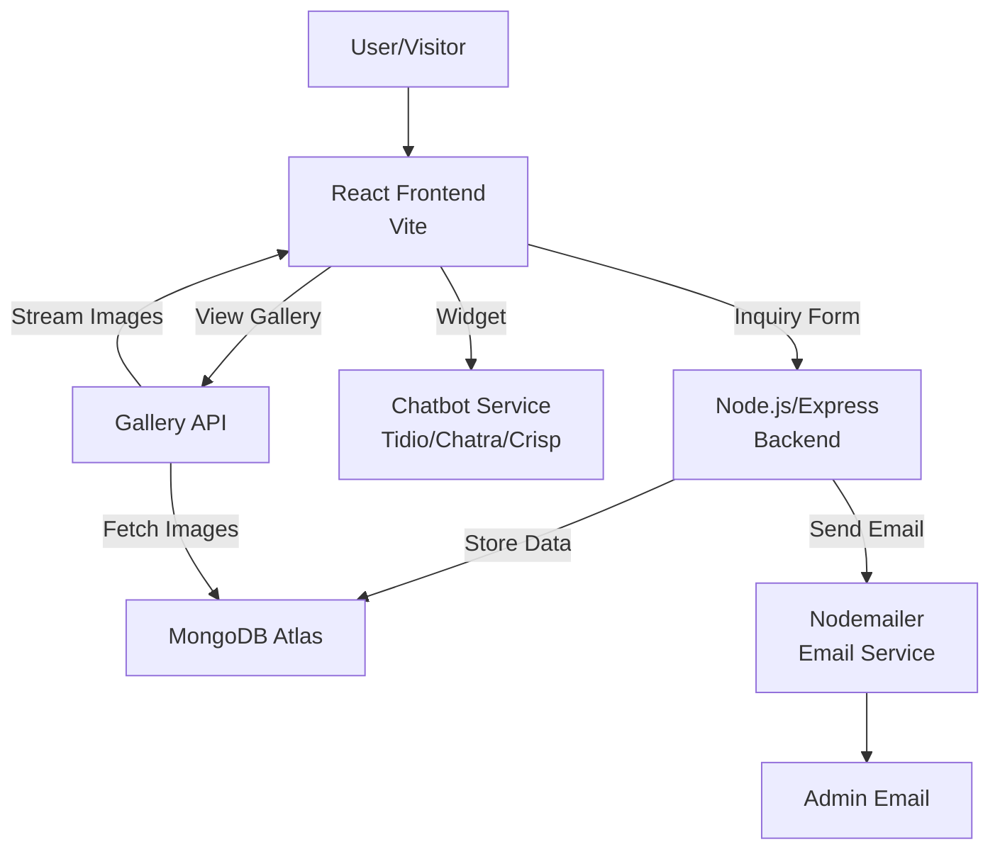

# Architecture Diagram (Mermaid)



---

# Event Management Demo Website

This is a full-stack event management demo website with:
- **Frontend:** React.js (Vite, deployable to Vercel/Netlify)
- **Backend:** Node.js + Express (deployable to Render/Vercel)
- **Database:** MongoDB Atlas (free tier, with GridFS for image storage)
- **Email notifications:** Nodemailer (Gmail/SendGrid/Mailgun)
- **Chatbot:** Integrate a free widget (Tidio/Chatra/Crisp/Dialogflow)
- **Gallery:** Upload and view event images per service (GridFS-backed API)

## Features
- Event inquiry form (frontend)
- Stores submissions in MongoDB (backend)
- Triggers email notification to admin (backend)
- Easy chatbot integration (frontend)
- Service galleries with image upload/view (backend + frontend)

---

## Setup Instructions

### 1. MongoDB Atlas
- Create a free account at [MongoDB Atlas](https://www.mongodb.com/cloud/atlas)
- Create a cluster and get your connection string
- Add it to your backend `.env` file as `MONGODB_URI`

### 2. Backend Setup
```sh
cd backend
cp .env.example .env # Edit .env with your credentials
npm install
node index.js
```
- The backend runs on port 5000 by default.
- Set up your email provider (Gmail/SendGrid/Mailgun) in `.env`.
- For image upload/gallery, install: `npm install multer multer-gridfs-storage mongodb`

### 3. Frontend Setup
```sh
cd frontend
npm install
npm run dev
```
- The frontend runs on port 5173 by default.
- To connect to the backend, ensure the API URL in `InquiryForm.jsx` matches your backend URL.
- Place service images in `frontend/public/images/` for static display, or use the gallery API for dynamic images.

### 4. Chatbot Integration
- Sign up at [Tidio](https://www.tidio.com/), [Chatra](https://chatra.io/), [Crisp](https://crisp.chat/), or [Dialogflow](https://dialogflow.cloud.google.com/)
- Copy the widget script and paste it into `frontend/public/index.html` before `</body>`

### 5. Gallery API (Image Upload/View)
- **Upload:** `POST /api/gallery/upload` (form-data: `image`, `service`)
- **List:** `GET /api/gallery/:service`
- **View:** `GET /api/gallery/image/:id`
- Use these endpoints to build a gallery page in React or for admin uploads.

### 6. Deployment
- **Frontend:** Deploy to [Vercel](https://vercel.com/) or [Netlify](https://www.netlify.com/)
- **Backend:** Deploy to [Render](https://render.com/) or [Vercel](https://vercel.com/)
- **Environment variables:** Set all `.env` values in your deployment dashboard

---

## Environment Variables
See `backend/.env.example` for required variables.

---

## Project Structure
```
website/
  frontend/   # React app
  backend/    # Node.js/Express API
```

---

## Notes
- All services have free tiers suitable for demos.
- For production, secure your credentials and use environment variables.
- Gallery endpoints use MongoDB GridFS for scalable image storage.
- All main content is rendered via React for consistent layout.
